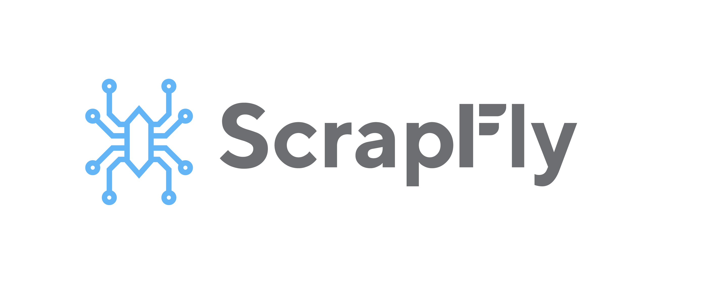

# curl_cffi


[](https://badge.fury.io/py/curl-cffi)

[curl-impersonate](https://github.com/lwthiker/curl-impersonate) 的 Python 绑定，基于
[cffi](https://cffi.readthedocs.io/en/latest/).

不同于其他的纯 Python http 客户端，比如 `httpx` 和 `requests`，`curl_cffi ` 可以模拟浏览器的
TLS/JA3 和 HTTP/2 指纹。如果你莫名其妙地被某个网站封锁了，可以来试试 `curl_cffi`。

0.6 版本在 Windows 上的指纹全错了，如果你用的是 Windows 的话，请尽快升级。造成不便，多有抱歉。

只支持 Python 3.8 和以上版本，Python 3.7 已经官宣退役了。

------

<a href="https://scrapfly.io/?utm_source=github&utm_medium=sponsoring&utm_campaign=curl_cffi" target="_blank"></a>

[Scrapfly](https://scrapfly.io/?utm_source=github&utm_medium=sponsoring&utm_campaign=curl_cffi)
是一个企业级的网页抓取 API，通过全流程托管来帮助你简化抓取流程。功能包括：真实浏览器
渲染，代理自动切换，和 TLS、HTTP、浏览器指纹模拟，可以突破所有主要的反爬手段。Scrapfly
还提供了一个监控面板，让你能够随时观察抓取成功率。

如果你在寻找云端托管 `curl_cffi` 服务的话，Scrapfly 是一个不错的选择。如果你希望自己管理
脚本，他们还提供了一个[curl 转 Python 的工具](https://scrapfly.io/web-scraping-tools/curl-python/curl_cffi)。

------

## 功能

- 支持 JA3/TLS 和 http2 指纹模拟，包含最新的浏览器和自定义指纹。
- 比 requests/httpx 快得多，和 aiohttp/pycurl 的速度比肩，详见 [benchmarks](https://github.com/yifeikong/curl_cffi/tree/master/benchmark)。
- 模仿 requests 的 API，不用再学一个新的。
- 预编译，不需要在自己机器上从头开始。
- 支持 `asyncio`，并且支持每个请求切换代理。
- 支持 http 2.0，requests 不支持。
- 支持 websocket。

|库|requests|aiohttp|httpx|pycurl|curl_cffi|
|---|---|---|---|---|---|
|http2|❌|❌|✅|✅|✅|
|sync|✅|❌|✅|✅|✅|
|async|❌|✅|✅|❌|✅|
|websocket|❌|✅|❌|❌|✅|
|指纹|❌|❌|❌|❌|✅|
|速度|🐇|🐇🐇|🐇|🐇🐇|🐇🐇|

## 安装

    pip install curl_cffi --upgrade

在 Linux(x86_64/aarch64), macOS(Intel/Apple Silicon), Windows(amd64), 这样应该就够了，如果
在其他小众平台，你可能需要先编译并安装 `curl-impersonate` 并且设置 `LD_LIBRARY_PATH` 这些
环境变量。

安装测试版：

    pip install curl_cffi --upgrade --pre

从 GitHub 安装最新不稳定版本：

    git clone https://github.com/yifeikong/curl_cffi/
    cd curl_cffi
    make preprocess
    pip install .

## 使用

尽量模仿比较新的浏览器，不要直接从下边的例子里复制 `chrome110` 去用。

### 类 requests

```python
from curl_cffi import requests

# 注意 impersonate 这个参数
r = requests.get("https://tools.scrapfly.io/api/fp/ja3", impersonate="chrome110")

print(r.json())
# output: {..., "ja3n_hash": "aa56c057ad164ec4fdcb7a5a283be9fc", ...}
# ja3n 指纹和目标浏览器一致

# To keep using the latest browser version as `curl_cffi` updates,
# simply set impersonate="chrome" without specifying a version.
# Other similar values are: "safari" and "safari_ios"
r = requests.get("https://tools.scrapfly.io/api/fp/ja3", impersonate="chrome")

# To pin a specific version, use version numbers together.
r = requests.get("https://tools.scrapfly.io/api/fp/ja3", impersonate="chrome124")

# 自定义指纹, examples 中有具体例子。
r = requests.get("https://tls.browserleaks.com/json", ja3=..., akamai=...)

# 支持使用代理
proxies = {"https": "http://localhost:3128"}
r = requests.get("https://tools.scrapfly.io/api/fp/ja3", impersonate="chrome110", proxies=proxies)

proxies = {"https": "socks://localhost:3128"}
r = requests.get("https://tools.scrapfly.io/api/fp/ja3", impersonate="chrome110", proxies=proxies)
```

### Sessions

```python
# sessions are supported
s = requests.Session()
# httpbin is a http test website
s.get("https://httpbin.org/cookies/set/foo/bar")
print(s.cookies)
# <Cookies[<Cookie foo=bar for httpbin.org />]>
r = s.get("https://httpbin.org/cookies")
print(r.json())
# {'cookies': {'foo': 'bar'}}
```

支持模拟的浏览器版本，和我 [fork](https://github.com/yifeikong/curl-impersonate) 的 [curl-impersonate](https://github.com/lwthiker/curl-impersonate) 一致：

不过只支持类似 Chrome 的浏览器。Firefox 的支持进展可以查看 [#59](https://github.com/yifeikong/curl_cffi/issues/59)。

只有当浏览器指纹发生改编的时候，才会添加新版本。如果你看到某个版本被跳过去了，那是因为
他们的指纹没有发生改变，直接用之前的版本加上新的 header 即可。

如果你要模仿的不是浏览器, 使用 `ja3=...` and `akamai=...` 来指定你的自定义指纹. 参见[文档](https://curl-cffi.readthedocs.io/en/latest/impersonate.html).

- chrome99
- chrome100
- chrome101
- chrome104
- chrome107
- chrome110
- chrome116 <sup>[1]</sup>
- chrome119 <sup>[1]</sup>
- chrome120 <sup>[1]</sup>
- chrome123 <sup>[3]</sup>
- chrome124 <sup>[3]</sup>
- chrome99_android
- edge99
- edge101
- safari15_3 <sup>[2]</sup>
- safari15_5 <sup>[2]</sup>
- safari17_0 <sup>[1]</sup>
- safari17_2_ios <sup>[1]</sup>

注意:
1. 自 `0.6.0` 起添加。
2. 在 `0.6.0` 中修复, 之前的 http2 指纹是[错误的](https://github.com/lwthiker/curl-impersonate/issues/215)。
3. 自 `0.7.0` 起添加。

### asyncio

```python
from curl_cffi.requests import AsyncSession

async with AsyncSession() as s:
    r = await s.get("https://example.com")
```

更多并发：

```python
import asyncio
from curl_cffi.requests import AsyncSession

urls = [
    "https://google.com/",
    "https://facebook.com/",
    "https://twitter.com/",
]

async with AsyncSession() as s:
    tasks = []
    for url in urls:
        task = s.get(url)
        tasks.append(task)
    results = await asyncio.gather(*tasks)
```

### WebSockets

```python
from curl_cffi.requests import Session, WebSocket

def on_message(ws: WebSocket, message):
    print(message)

with Session() as s:
    ws = s.ws_connect(
        "wss://api.gemini.com/v1/marketdata/BTCUSD",
        on_message=on_message,
    )
    ws.run_forever()
```

对于底层 API, Scrapy 集成等进阶话题, 请查阅 [文档](https://curl-cffi.readthedocs.io)

有问题和建议请优先提 issue，中英文均可，也可以加 [TG 群](https://t.me/+lL9n33eZp480MGM1) 或微信群讨论：


## 致谢

- 该项目起初 fork 自：[multippt/python_curl_cffi](https://github.com/multippt/python_curl_cffi), MIT 协议发布。
- Headers/Cookies 代码来自 [httpx](https://github.com/encode/httpx/blob/master/httpx/_models.py), BSD 协议发布。
- Asyncio 支持是受 Tornado 的 curl http client 启发而做。
- WebSocket API 的设计来自 [websocket_client](https://github.com/websocket-client/websocket-client)。

## [赞助商] Cloudflare 5s 盾接口

<a href="https://yescaptcha.com/i/stfnIO" target="_blank"></a>

Yescaptcha 是一个可以识别 Cloudflare 盾的接口，直接返回识别完成的 Cookies （`cf_clearance` 等） [点此](https://yescaptcha.com/i/stfnIO)注册：https://yescaptcha.com/i/stfnIO

## [赞助商] ScrapeNinja

<a href="https://scrapeninja.net?utm_source=github&utm_medium=banner&utm_campaign=cffi" target="_blank"></a>

[ScrapeNinja](https://scrapeninja.net?utm_source=github&utm_medium=banner&utm_campaign=cffi) 是一个网络采集 API，它有两个引擎：极速版，性能
较好，可以模拟 TLS 指纹；和通用版，使用浏览器。

ScrapeNinja 帮你解决无头浏览器，代理，超时，重试，并且负责数据抽取，这样你可以直接拿到
JSON 数据。在所有的订阅方案中，切换代理都是直接可用的。

## 赞助


## 引用

If you find this project useful, please cite it as below:

```
@software{Kong2023,
  author = {Yifei Kong},
  title = {curl_cffi - A Python HTTP client for impersonating browser TLS and HTTP/2 fingerprints},
  year = {2023},
  publisher = {GitHub},
  journal = {GitHub repository},
  url = {https://github.com/yifeikong/curl_cffi},
}
```
